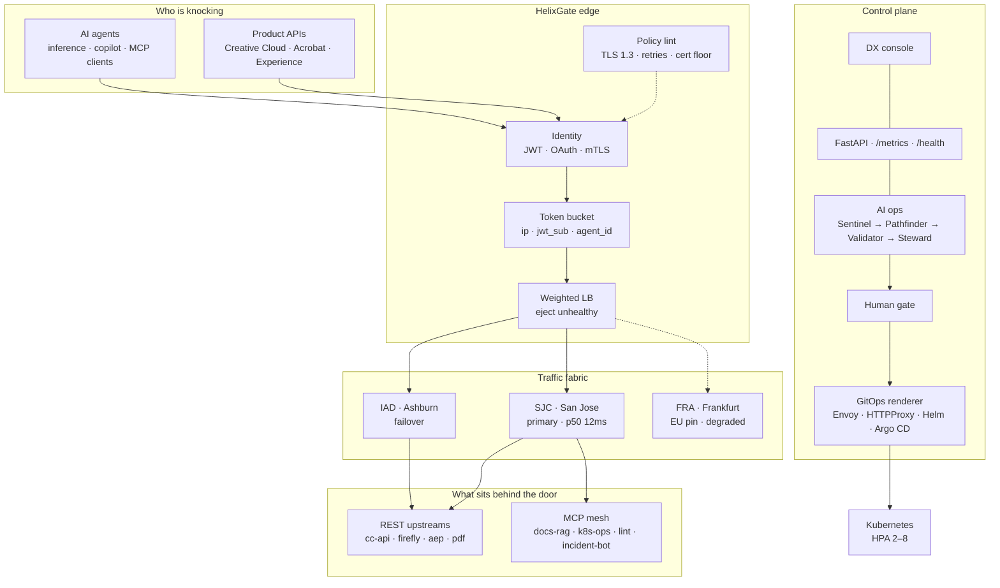
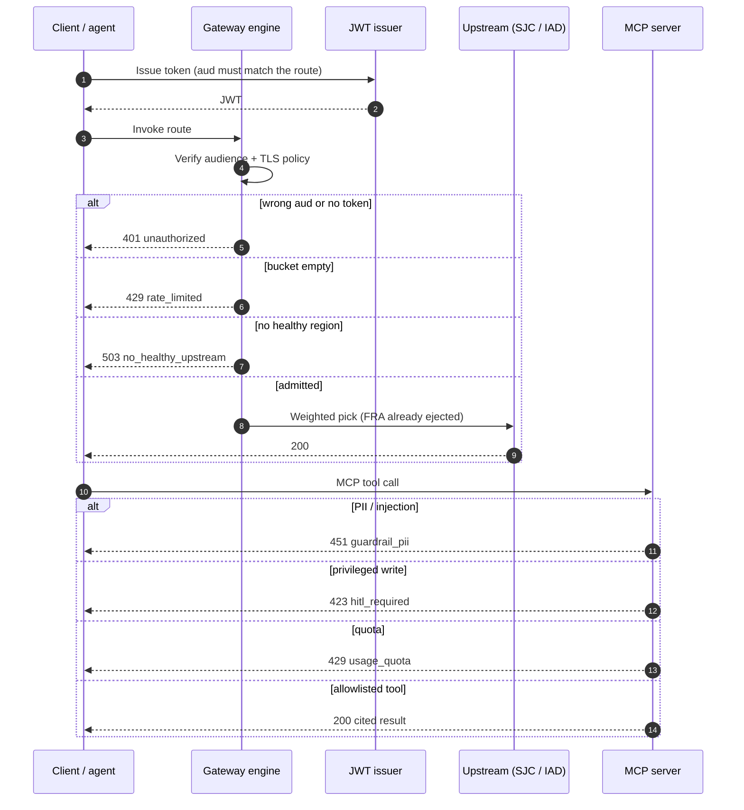
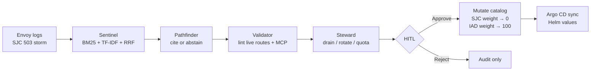

# HelixGate

<p align="center">
  
</p>

<p align="center">
  <strong>The door every API and AI agent has to walk through.</strong><br/>
  <em>San Jose primary · Ashburn failover · Frankfurt EU pin</em>
</p>

<p align="center">
  <a href="https://helixgate.onrender.com"><strong>▶ Live control plane</strong></a>
  &nbsp;·&nbsp;
  <a href="https://helixgate.onrender.com/docs"><strong>Swagger</strong></a>
  &nbsp;·&nbsp;
  <a href="docs/ARCHITECTURE.md"><strong>Architecture notes</strong></a>
</p>

<p align="center">
  <a href="https://github.com/Ananyanagaraj11/helixgate/actions"></a>
  
  
  
</p>

---

A creative studio ships a thousand APIs. An agent mesh ships a thousand more. Someone still has to decide **who gets through, to which region, under which quota, and who is allowed to change the gate itself.**

HelixGate is that door — a Developer Experience control plane for **API traffic and MCP servers** on a Kubernetes-shaped edge. It is not a chatbot taped to YAML. Burst the demo: you will get a real JWT, a real `429`, a PII `451`, and a privileged MCP write that stays `423` until a human approves.

```
        APIs                         agents
          \                           /
           \     TLS 1.3 · JWT       /
            \    rate limit · mTLS  /
             >>>>>>>  HELIX  <<<<<<<
            /    Envoy · Contour    \
           /     MCP guardrails      \
          /                           \
     SJC primary                  GitOps + HITL
```

**Why San Jose?** That is where a Bay Area DX team would actually run the primary. `sjc-prod-1` is home. Ashburn is the failover. Frankfurt is an EU pin — not a global dump — and in the demo it is already *degraded*, so you can watch the helix unwind traffic away from a sick region.

---

## Architecture

One plane. Three jobs: **admit**, **observe**, **remediate**.



### A request walking the helix



### When the door starts 503-ing

Recurring ops work becomes a four-agent graph. Steward drafts the change. **Git stays the source of truth. A human still turns the key.**



San Jose carries ~70% of creative-cloud weight until it is sick. Then the runbook is not “hope FRA absorbs it.” FRA is the EU pin and it is already unhealthy. The helix shifts **SJC → IAD**, the same way a San Jose on-call would.

---

## What the console proves

| Open this | You should feel | Live signal |
|-----------|-----------------|-------------|
| Overview → Burst 12 | The edge is real | `200` then `429` |
| MCP PII probe | Agents do not get a free pass | `451 no_pii_egress` |
| `k8s-ops` / `apply_patch` | Production writes are not a toy | `423` until HITL |
| AI ops → 503 sample | Diagnosis is grounded or it abstains | Citations + Steward waiting |
| Approve apply | Remediation is reversible and gated | SJC drained, IAD takes traffic |
| GitOps tab | Self-service is GitOps-shaped | Envoy · HTTPProxy · Helm · Argo · NGINX |
| Identity · TLS | Policy is code | Lab route fails TLS 1.3 / auth / rate limit |

**Stack:** FastAPI · Python · JWT · Envoy / Contour / NGINX · Helm · Argo CD · Kubernetes · hybrid RAG · MCP guardrails · Prometheus · Docker · GitHub Actions

---

## 90 seconds on the live plane

[helixgate.onrender.com](https://helixgate.onrender.com) — free Render may sleep ~40s.

1. Issue a JWT for `creative-cloud-api`. Burst 12. Watch the bucket trip.
2. MCP PII probe — the mesh should refuse.
3. AI ops → *SJC Envoy 503 storm on /v2/creative, FRA already unhealthy*.
4. Approve the drain. San Jose goes quiet. Ashburn carries the helix.
5. GitOps → `firefly-inference` → flip the five manifests.

Other storms on the board: MCP quota, Argo drift, TLS expiry, JWT audience mismatch, unsigned lab route.

---

## Run it locally

```bash
git clone https://github.com/Ananyanagaraj11/helixgate
cd helixgate
python -m venv .venv && .venv\Scripts\activate
pip install -r requirements.txt
$env:PYTHONPATH = "src"
uvicorn helixgate.api.main:app --reload --port 8080
```

[http://localhost:8080](http://localhost:8080)

```bash
docker compose up --build
pytest tests -q
ruff check src tests
```

```
dashboard/                 DX console
src/helixgate/
  gateway/engine.py        Admit: JWT, LB, token bucket
  mcp/mesh.py              Guard: allowlist, PII, quota, HITL
  agents/ops.py            Remediate: 4-agent graph
  rag/                     BM25 + vectors + RRF
  gitops/renderer.py       Envoy / HTTPProxy / Helm / Argo
infra/                     Kubernetes, Helm, Argo CD, Envoy, Contour
```

---

## Say this in an interview

> HelixGate is the control plane I would want if I owned API and AI gateway infrastructure. Clients and agents share one door: JWT audiences, rate limits, TLS 1.3, weighted regions. San Jose is primary because that is where the team sits; Ashburn is failover; Frankfurt is an EU pin and it is already ejected in the demo. MCP servers live behind the same policies — PII never egresses, privileged kubectl-shaped tools stay 423. When Envoy 503s, Sentinel retrieves the runbook, Validator lints live config, and Steward will drain SJC — but only after a human, and only as GitOps.

Then pause: *Want the gateway engine, the MCP guardrails, or the agent graph?*

---

**Ananya Naga Raj** · [GitHub](https://github.com/Ananyanagaraj11) · [LinkedIn](https://www.linkedin.com/in/ananyanagaraj/)

MIT License
