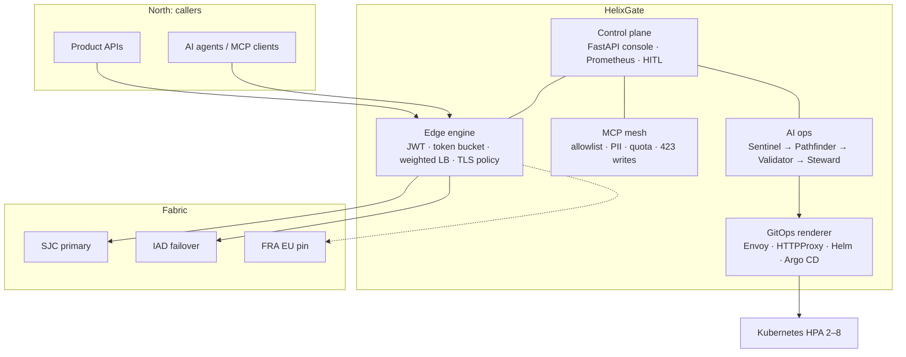

# HelixGate architecture

HelixGate is a **developer-experience control plane** for API and AI traffic: one door to route, authenticate, observe, and remediate gateway + MCP configuration.

San Jose (`sjc-prod-1`) is the primary region — that is where a Bay Area DX team would actually sit. Ashburn is failover. Frankfurt is an EU pin, not a global overflow, and the demo leaves it degraded on purpose.

## Why this shape

A reverse proxy is not a DX platform. Recurring work — 503 outlier ejection, cert floors, Argo drift, MCP quota storms — has to become **automation with a human gate**, not a ticket pile.

## Control plane

FastAPI serves the console and `/api/*`. Prometheus scrapes `/metrics`. Kubernetes readiness uses `/health`.

The live demo runs an in-process gateway engine (token bucket, JWT audience checks, weighted upstream pick) so a recruiter can hit **real 401 / 429 / 451 / 423** without a cluster.

## GitOps

`infra/` is the source of truth:

| Path | Role |
|------|------|
| `infra/helm/helixgate` | Chart + values (replicas, HPA 2–8, TLS, rate limit) |
| `infra/argocd` | Application CR for the control plane and MCP mesh |
| `infra/envoy` | Static Envoy listener sketch |
| `infra/contour` | HTTPProxy custom resource |
| `infra/kubernetes` | Namespace, Deployment, Service, HPA, Ingress |

The console **renders the same artifacts per route** so self-service publishing is GitOps-shaped, not kubectl-shaped.

## AI ops

Hybrid retrieval is BM25 + TF-IDF cosine + Reciprocal Rank Fusion over gateway runbooks. The analyst **abstains** without a cited chunk. Steward never applies a production change until HITL approve mutates the live catalog (drain region, rotate TLS, raise quota, lock a lab route).
